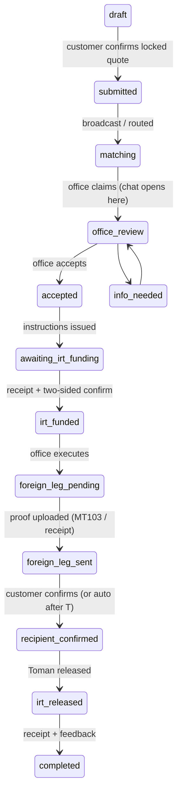
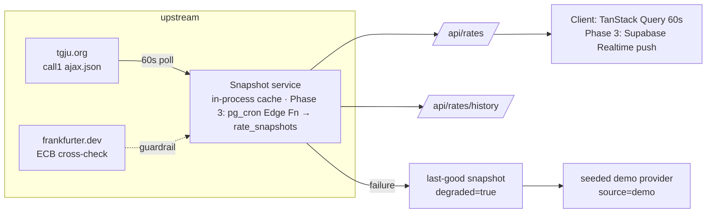

# Asaex — Architecture

_Phase 0–1 as built; later phases are designed here so early code doesn't paint
us into corners. See `/docs/decisions/` for the reasoning behind each choice._

## 1. The order state machine (§8) — restated

A transfer is a **supervised, two-sided settlement** between a verified
customer and a licensed exchange office. The money-movement ordering is the
platform's core risk control:

> **The Toman leg always funds first and releases last.**
> Toman enters the supervised flow before the office executes anything
> abroad, and it is released to the office only after the foreign recipient's
> receipt is confirmed. If the foreign leg fails, the Toman is still inside
> the supervised flow and refundable. No single actor can advance a funding
> state alone — every money step needs the counterparty's (or platform's)
> confirmation.



Side states (`on_hold · disputed · cancelled · refunded · expired ·
sla_breached`) hang off the happy path with explicit entry/exit rules encoded
in `supabase/migrations/0004…::allowed_transitions()`. Key properties:

- Transitions are **Postgres functions with explicit guards**
  (`assert_transition(order, from, to, actor, role, reason, version)`),
  invoked from Edge Functions. RLS grants no direct `UPDATE orders.state`.
- Every transition appends to `order_events` (append-only, trigger-enforced) —
  actor, ip, reason, attachment — which drives the customer timeline UI.
- Optimistic concurrency via `orders.version`; idempotency keys at the API
  layer (Phase 3).
- Refunds/corrections are **compensating ledger entries**, never mutation.

### Risks flagged before building (§22.1)

1. **`recipient_confirmed` by timeout** ("auto after T") — auto-confirming
   release of the Toman on silence is the riskiest default in the flow.
   Mitigation: long T, loud multi-channel nudges, office-supplied proof
   required first, and dispute freezes the timer. T must be a per-corridor
   admin setting, not a constant.
2. **Stale-rate disputes** — the single biggest dispute source. Mitigated by
   the 15-minute visible lock, persisted locked rate on the order, and
   re-quote requiring customer re-acceptance (§7.2).
3. **tgju as a single price source** — mitigated by the provider abstraction,
   ECB cross-check guardrail, degraded-state honesty, and manual-override
   rate source planned for admin (§4.3 /admin/rates).
4. **Friday/holiday gaps** — SLA math must run on the business calendar
   (Iran: Sat–Wed full, Thu half, Fri closed) or every weekend breaches.
5. **P2P without escrow discipline** — P2P routes through the same order
   machine with an office as escrow agent; it must never get a "lighter" path.

## 2. Rates pipeline (§7)



- Prices are Rial upstream; ÷10 → **Toman once, at ingestion**. All app math
  is Toman (`IRT`).
- Failover chain: tgju → last-good (degraded) → deterministic demo
  (degraded + labelled). Stale is never silent.
- Browser never talks to upstream; keys stay server-side.
- Pricing (§7.2) is layered spread (platform floor → corridor → office →
  tier → promo) + explicit platform/office fees, all itemized in the quote UI
  and persisted per-order later.

## 3. Ledger (§11)

Double-entry from day one: `ledger_accounts` (platform / office / customer /
suspense per currency) and append-only `ledger_entries`, with a deferred
constraint trigger asserting Σdebit = Σcredit per `txn_id` per currency.
Order flows will write: customer suspense in → office payable → fee revenue —
every movement two rows, corrections as compensating entries.

## 4. Surfaces & code layout

One Next.js 15 app (App Router, RSC), locale segment at the root:

```
src/app/[locale]/            customer PWA (Phase 0–1: home · rates · transfer quote ·
                             orders/profile placeholders · legal · design)
src/app/[locale]/design      /_design (§17.20) — served via rewrite
src/app/api/*                rates snapshot/history/health (server-only)
src/lib/rates/*              provider abstraction · pricing · service cache
src/lib/validators/*         Sheba/IBAN mod-97 · Luhn+BIN · national code
src/lib/money/format.ts      the one number/date formatter (fa digits, Jalali)
supabase/migrations/*        full §11 schema + RLS + state machine + ledger
```

`/office` and `/admin` mount on the same design system. RLS is the security
boundary; `src/lib/auth/can.ts` mirrors §5's role table for UI gating and is
convenience only — every capability it names is re-checked by the RLS policy or
the SECURITY DEFINER function behind it, so a wrong answer here shows a button
the database then refuses rather than opening a door.

The administrator's overrides — forcing a transition, refunding, impersonating
an office — widen what a caller may do without narrowing what gets recorded:
each takes a written reason as an argument, writes an `audit_log` row, and (for
transitions) marks the `order_events` row `forced`. ADR 0016 has the reasoning;
`audit_row` triggers on every configuration table are what make it hold for
edits that do not go through a function at all.

## 5. PWA & offline (§14)

Serwist service worker: precached shell, NetworkFirst for `/api/rates` (last
snapshot survives reload offline), `/offline` document fallback, installable
manifest with shortcuts. The rate-status chip derives honesty from
`fetchedAt`/`observedAt`, so offline/stale is always labelled.
