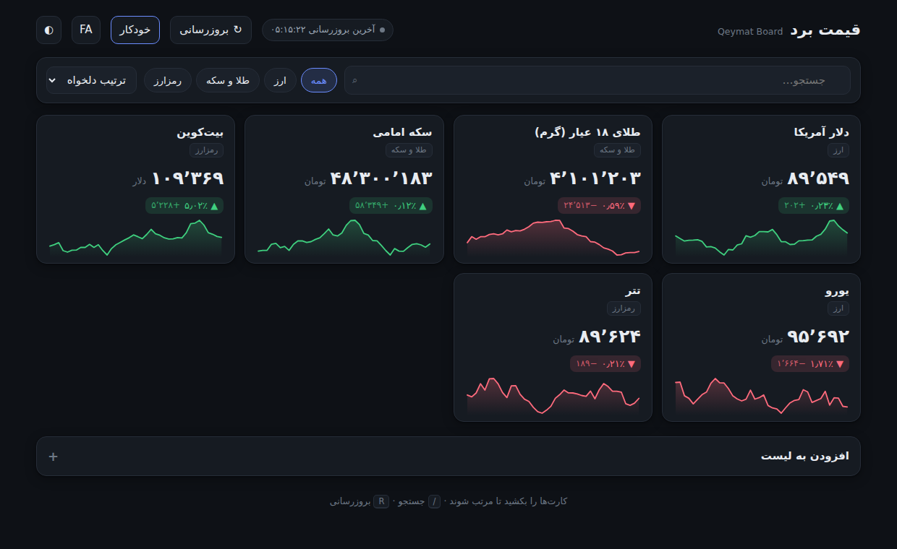

# Qeymat Board — قیمت برد

A single-file price watchlist. Open `index.html` in a browser — no build step, no
install, no server. Works offline.



## What it does

- **Watchlist** of currencies, gold/coin, and crypto. Add and remove assets, drag
  cards to reorder.
- **Live prices** with a day-change figure (percent and absolute) and a 40-point
  sparkline per asset, coloured by direction.
- **Auto-refresh** every 5 seconds, toggleable, plus a manual refresh.
- **Filter and sort** by group, free-text search, or by top gainers/losers.
- **Persian and English**, with the layout flipping between RTL and LTR and
  numbers formatted for the active locale (Persian digits in FA).
- **Light / dark / follow-system** themes.
- Everything — watchlist, order, prices, history, preferences — persists to
  `localStorage`, so the board comes back exactly as you left it.

Keyboard: <kbd>/</kbd> focuses search, <kbd>R</kbd> refreshes, <kbd>Esc</kbd>
clears the search box.

## Where the prices come from

Out of the box the board runs on a **simulated** source: a random walk seeded from
plausible starting values, with mean reversion so it does not drift somewhere
silly if you leave the tab open. That is what makes the file work with no network.

Every price in the UI arrives through one function:

```js
fetchRates(ids) -> Promise<{ [id]: { price: number, ts: number } }>
```

To go live, fill in the `liveSource` block near the top of the script (it is
already written out as a comment) and change one line:

```js
let activeSource = liveSource;   // was: simulatedSource
```

Nothing else in the file needs to change — rendering, history, persistence, and
the day-change maths all sit behind that one call.

Two things to know when you switch:

- Opening the file directly gives you a `file://` origin, and browsers block
  cross-origin requests from there. Serve the folder instead:
  `npx serve .` or `python -m http.server 8000`.
- The API has to send `Access-Control-Allow-Origin`, or you will need a small
  proxy in front of it.

## Adding an asset

One entry in the `CATALOG` array at the top of the script:

```js
{ id:'cad', group:'currency', unit:'toman', seed:65000, vol:0.004,
  fa:'دلار کانادا', en:'Canadian Dollar' },
```

- `unit` — `'toman'` or `'usd'`, controls the suffix and decimal places
- `seed` — starting price, and the anchor the simulation reverts toward
- `vol`  — per-tick volatility for the simulated source only; live data ignores it

It shows up under "Add to watchlist" immediately.

## Layout

```
qeymat-board/
  index.html    the whole app — markup, styles, logic
  preview.png   screenshot used above
  README.md
```
